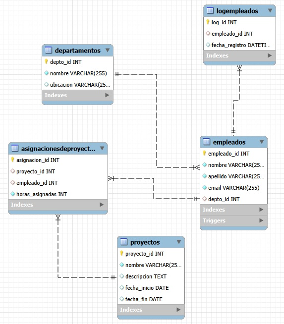

# SQL_BASE_EMPRESA 
tomada desde el curso de SQL, este repositorio contiene una base del organigrama de una empresa (listando empleados,proyectos,departamentos,identificadores de trabajo), donde se realizaron las siguientes consultas 
* Diagrama de identidad relacional

  

