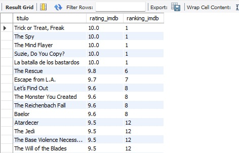
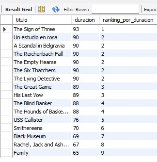
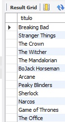
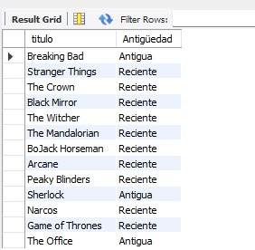
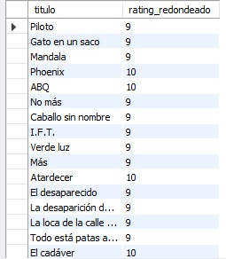
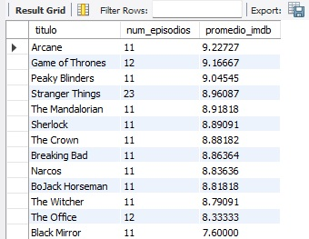
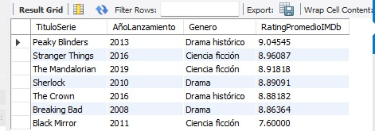

## Ranking por calificación IMDb

  

## Ranking por duración con DENSE_RANK

  

## Series con promedio IMDb > 8

  

## Antigüedad de series

  

## Categoría de género

  

## Redondear rating hacia arriba

  

## Número de episodios y promedio IMDb por serie

  

## Series de los 3 géneros más frecuentes con promedio IMDb

  

